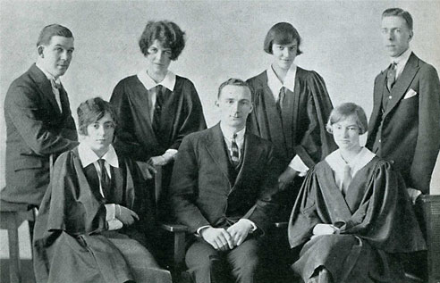
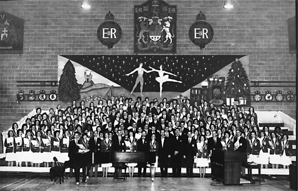
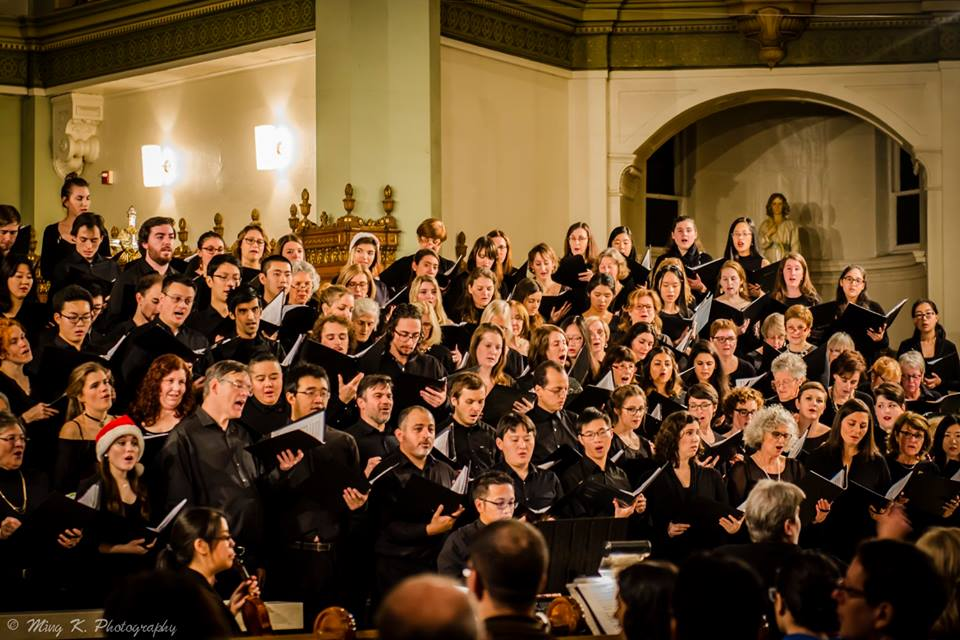
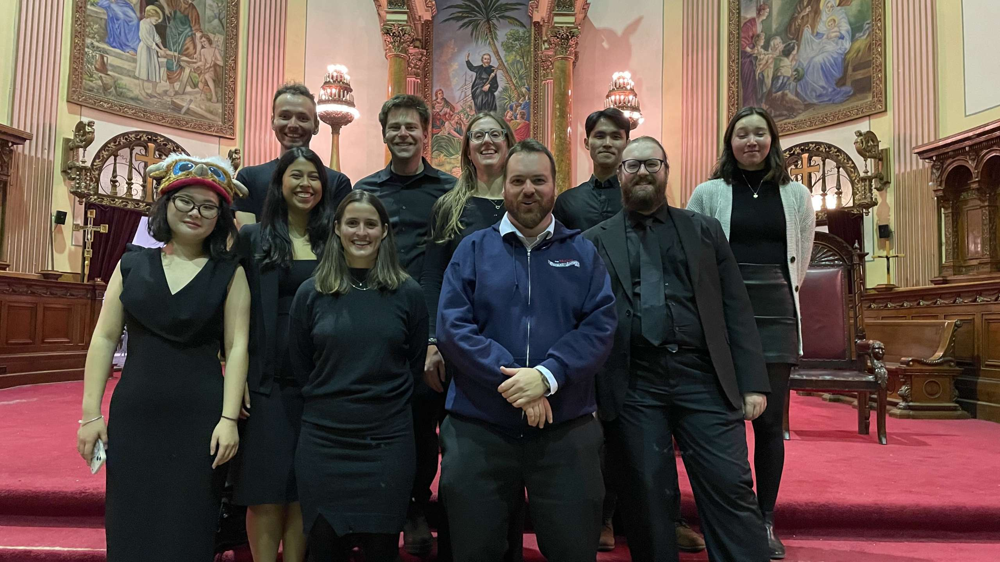

The **McGill Choral Society-SSMU (MCS)** is a non-profit student organization dedicated to making great music! As one of the largest student groups on the McGill campus, MCS gives members the chance to explore and enjoy the experience of making music together. While MCS is officially a club of the Students’ Society of McGill University (SSMU), it is also open to students of other universities and members of the general public. The executive of the choir is comprised of McGill students, with a subcommittee of non-student members who assist the main executive.

Usually, each year, we perform two major classical choral works: one in our Fall concert at the end of November, and the other in our Spring concert at the end of April. Our audiences range from 500 to 1000 people! We are accompanied by a small orchestra and professional soloists. In the second half of our concerts, we perform a selection of seasonal and popular music.

Previously, we have performed Carmina Burana, Haydn’s Lord Nelson Mass, Rutter’s Gloria, Mozart’s Coronation Mass, Handel’s Messiah, Brahms’s Requiem, Dvořák’s Mass in D, Fauré’s Requiem, and Bach’s Magnificat

<h1 style="text-align: center;">History</h1>

MCS Student Executive, 1926

 

MCS was formed in 1924 and evolved into one of the most active and important parts of McGill University’s musical tradition.

In the 1930s, the group was known as the Operatic and Choral Society, reflecting its repertoire. In the period following the mid-1940s, MCS evolved into a well-known and important part of the amateur music scene in Montreal. With a membership approaching 250 hard working students, it was one of the most active and enthusiastic clubs on campus. Long-playing records were issued for sale for their end of term ‘Sing at Christmas’ and ‘Springsong’ concerts of 1959, 1965, and 1968. The growth of the group is attributed to its director, Gifford Mitchell, who was with the society since 1945. Unfortunately, with his retirement, the society folded and remained dormant until 1982.

MCS Christmas Concert, 1963
 

The ensemble, under the name of “McGill Choral Society” was revived by Suzanne Byrnes, who became president in 1982. Under the dynamic direction of Mary Jane Puiu, MCS has grown from a small group of 30 to an impressive 150 singers. Classical works, spirituals, and Broadway musicals have been included in the choir’s repertoire. In the last few years, MCS has performed major choral works including Carmina Burana, Brahms’s Requiem, Haydn’s Lord Nelson Mass, Mozart’s Requiem and Handel’s Messiah. On November 11, 2010, MCS held a 30th Anniversary Gala, commemorating Director Mary Jane Puiu’s 30 years with the MCS. Many of our alumni were in attendance at the gala, which was an evening of remembrance, celebration, and music.

Choristers performing in the MCS Fall Concert, 2016
 

In accordance to changes in SSMU regulations, the choir was renamed as “McGill Choral Society-SSMU” in 2012. Currently, MCS has an average membership of 220 choristers; we remain one of the largest active student clubs at McGill University.

MCS Student Executives with choir director Louis Desjarlais, 2023

 
In 2024 the McGill Choral Society is celebrating its 100th anniversary. After the passing of Mary Jane Puiu in 2023, who served as a director and conductor for 43 years until the very last semester, the choir is now directed by Louis Desjarlais. He is a young Montreal composer with a master’s degree in composition from the University of Montreal. A skilled multi-instrumentalist, he has spent over a decade working specifically in the field of choral singing.