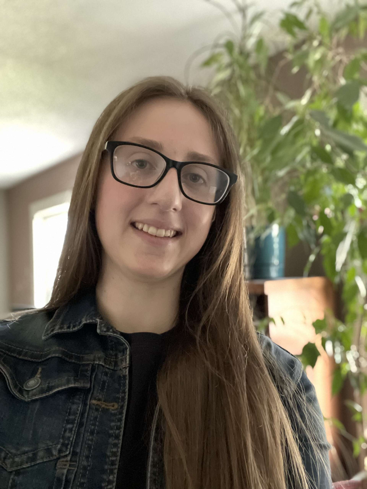
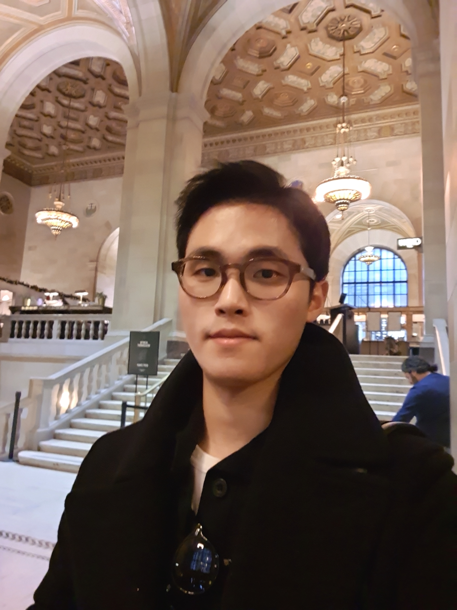
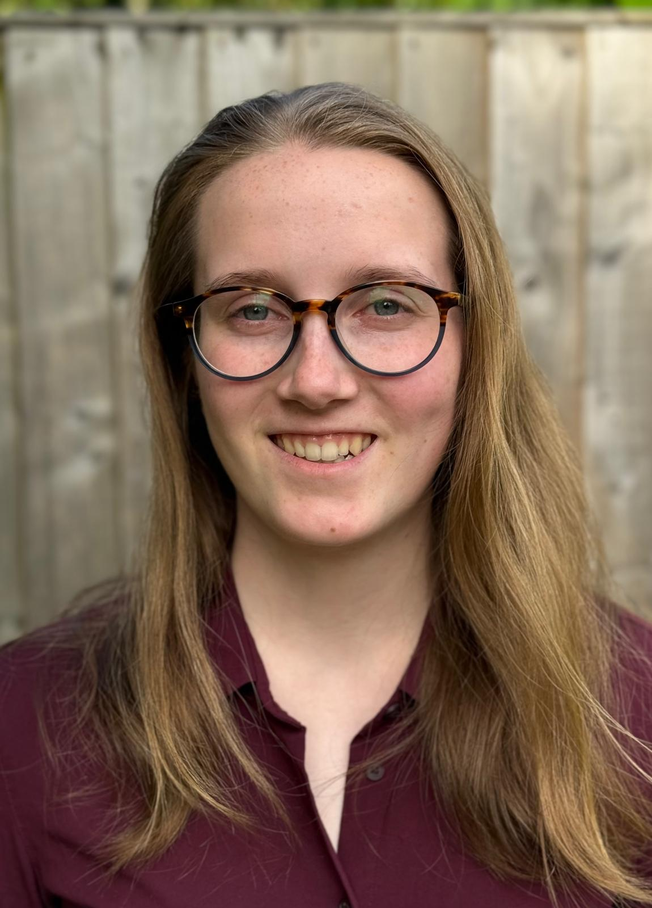
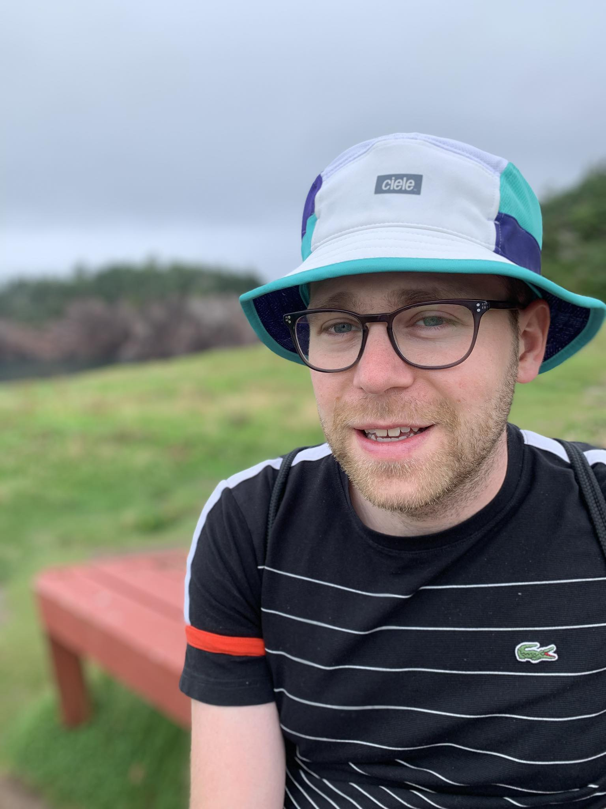
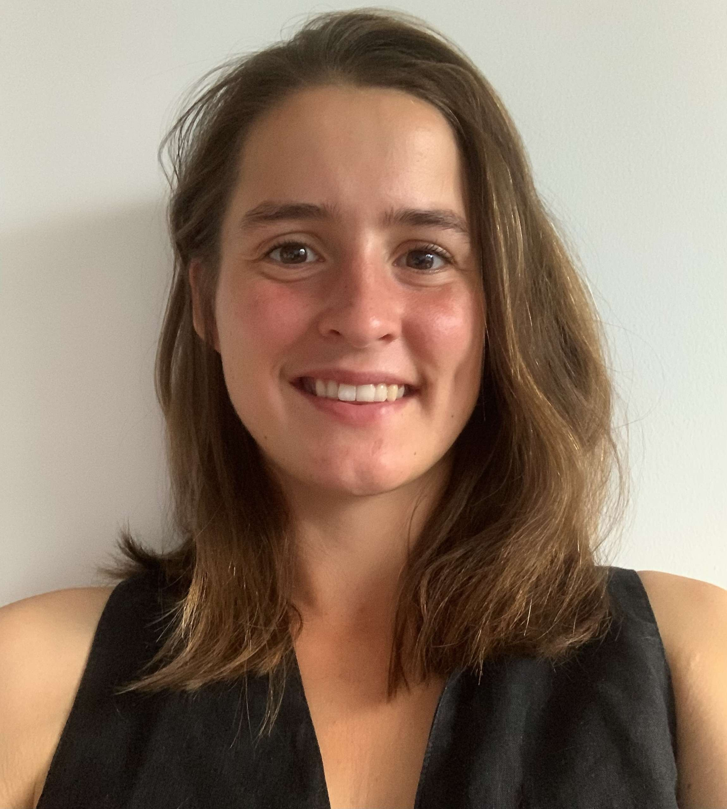
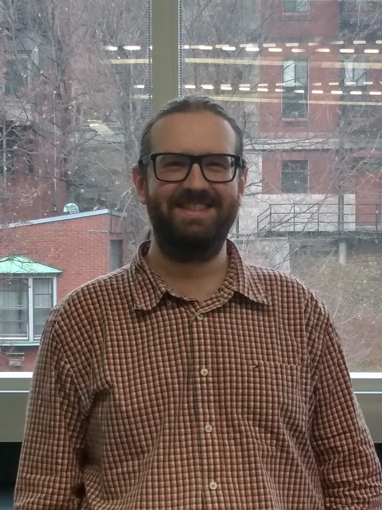
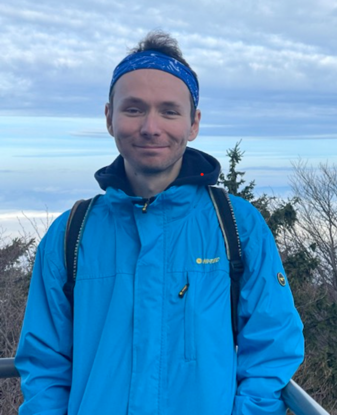
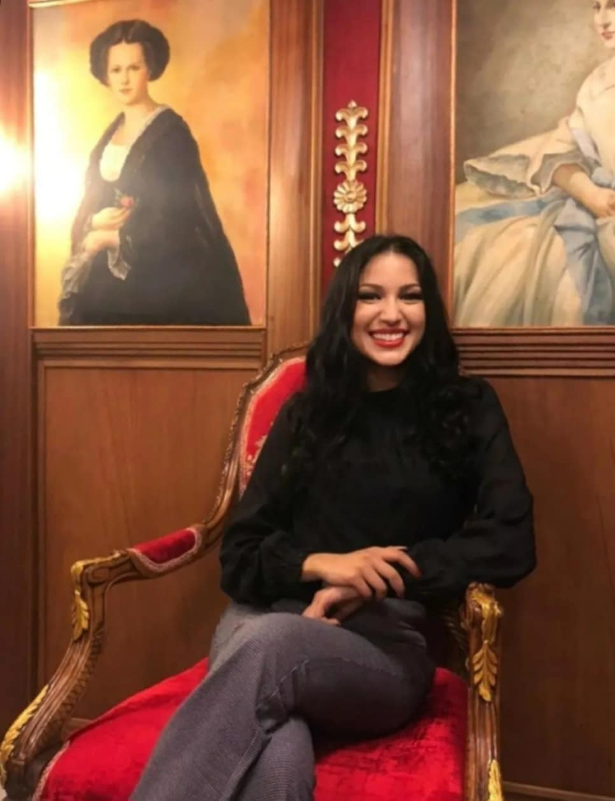

The executive team of the McGill Choral Society consists of a group of McGill students, who work closely with our Musical Director, and strive to make your MCS experience the best possible! We are responsible for fundraising, book-keeping, and ensuring that our concerts and rehearsals are organized.

In addition to the Student Executive Team, we have a Senior Support Committee which consists of a group of older members of the choir. They offer their advice and experience to the Student Executive Team, and help us ensure that the choir runs smoothly.

## Executive Team 2024-2025:
 
 

<h3 style="text-align: center;">Sofia Lang, President</h3>

    

        
    

    

        
Hi! My name is Sofia, and I am a third year student at McGill studying biomedicine and life sciences. I was part of my high school’s chamber and jazz choir ensembles and had private vocal training for six years prior. Singing is one of my biggest passions and I am very excited to be singing with the MCS! I also really enjoy cooking and reading books.

    

<h3 style="text-align: center;">Aiden Lee, Vice President</h3>

    

        
    

    

        
Hi everyone! My name is Aiden Lee, and I am a U1 student studying psychology at McGill.
I am happy to take part in the McGill choir since I loved singing in the local youth choir as a child. When it’s not too cold, I enjoy running half-marathon, which I began while serving in Korean Army. In my spare time, I write poems and read philosophy books, which are my biggest passion.

    

<h3 style="text-align: center;">Anne Di Vittorio, Treasurer</h3>

    

        
    

    

        
Hi! My name is Anne and I’m an undergrad at McGill in physiology. I joined the choir as I always liked singing and love the community feeling from singing in such a large group. I participated in choirs or singing through most of my pre-uni life and I’m always singing to myself so joining this group was a natural decision. My hobbies also include baking French pastries (my current long-term project has been learning to make macarons) and making miniature models.

    

<h3 style="text-align: center;">Rachel Yang, VP Communications</h3>

    

        
    

    

        
Hello everyone! My name is Rachel (Ruihan) Yang, originally from Beijing, China. I’m a U2 student majoring in cognitive science. Music is a passion for me. I started singing in a choir when I was 6 years old, and music accompanied me throughout my teenage years. Now I join the MCS executive team, hoping to help more people who love music and contribute to the development of MCS. Besides music, I love traveling, sports, and visiting museums.

    

<h3 style="text-align: center;">Mihai Mesko, Stage Manager</h3>

    

        
    

    

        
My name is Mihai,  I’m a 3rd year student in Medicine at McGill. My only singing experience comes from screaming Billy Talent songs in the car. If that sounds like you, it means you too can join choir! My mother forced me to do piano for 14 long years, which taught me how to read music and how to lie effectively about how much I practiced that day. 

I like to play video games, knit socks, ride vintage road bicycles, go camping, and I’m always looking forward to my next meal. 

Looking forward to doing things a stagemanager might do to you (like perhaps…..arranging you on the stage and telling you what to do).

    

<h3 style="text-align: center;">Klara Goettke, Merch lead</h3>

    

        
    

    

        
Hi 🙂 My name is Klara. I joined the McGill Choral Society as I really enjoyed my choir undergraduate experience at Bishop’s University. Music has always been an ‘escape’ from the everyday for me. Growing up, it was through piano (10 years) and then I switched over to flute. I have played flute for over 12 years now and continue to enjoy it.

Outside of music, I enjoy all outdoor sports and exploring my limits in all aspects of life. I am currently a medical student at McGill (MDCM 2025) and look forward to continually incorporating music into my routine.  

    

## Honorary Members:

<h3 style="text-align: center;">Jean-Frédéric Olivier</h3>

    

        
    

    

        
Hello everyone! My name is Jean-Frédéric Olivier, and I am a Tenor in the McGill Choral Society choir since Spring 2019. I am currently a PhD student in Biochemistry at the McGill Research Center on Complex Traits in Dr. Gros laboratory, but even though my primary curriculum is in science, I love music in all its form, particularly choir singing. When I am not doing research or rehearsals (I am also a member of 2 other amazing choirs, Phoebus and Coeur du Plateau), I usually give my time to a not-for-profit organization, the CDTL, to help integrating young school dropouts into the labor market. Oh! And I love cooking, especially tasty vegetarian recipes.

    

<h3 style="text-align: center;">Marek Borik</h3>

    

        
    

    

        
Hi! My name is Marek Borik and I sing tenor voice. I finished BSc in Computer Science three years ago and now I work full time. I have always loved playing the guitar and singing for myself and my friends, but I wanted to improve my level of singing, so I decided to join a choir. I have been part of MCS since Fall 2022 and been absolutely loving it. My hobbies include travelling, camping, hiking, playing or listening to music, reading and writing poetry… there are so many things to keep me busy!  I also wrote, shot and edited several short films since high school and spent 3 years in the film club “The Plumber’s Station McGill”, so I utilize my experience with recording the choir performances for YouTube and live-streaming the rehearsals.

    

<h3 style="text-align: center;">Roufaïda Lamrabet</h3>

    

        
    

    

        
Hello! I'm Roufaïda Lamrabet, a Soprano with the McGill Choral Society. In addition to my full-time job, I am a freelance social media manager. I was part of a choir in my home country of Morocco for 10 years. After moving to Canada, I discovered the McGill Choral Society and immediately felt at home when I joined. I have used my experience and skills to help manage the choir's social media presence. Beyond singing and marketing, I also have a passion for painting, which I enjoy in my free time.

    

